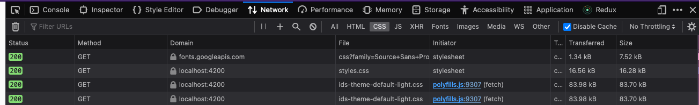
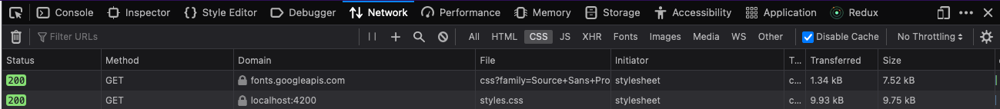

# Assets Issue

## tldr; assets for applications using esbuild,configured with glob pattern in project.json, is not being requested, in difference to the applications using webpack.

In this example workspace I have configured 4 different applications that uses angular 16, tailwindcss and ids-enterprise-wc (a third party ui web components library). These 4 applications have different setups, two using NgModule style and two using standalone components (didn't really matter). One NgModule style and one standalone components style uses webpack, and the other ones uses esbuild.

In the project.json i have configured to include assets with the glob pattern. Theses assets are used and needed by the third party UI library.

For the applications that uses esbuild, these assets (themes) are not being requested like the applications that uses webpack.

Webpack

Esbuild

## Start the applications

- `npm run start1` for NgModule style with esbuild
- `npm run start2` for NgModule style with webpack
- `npm run start3` for standalone style with esbuild
- `npm run start4` for standalone style with webpack

##

✨ **This workspace has been generated by [Nx, a Smart, fast and extensible build system.](https://nx.dev)** ✨
